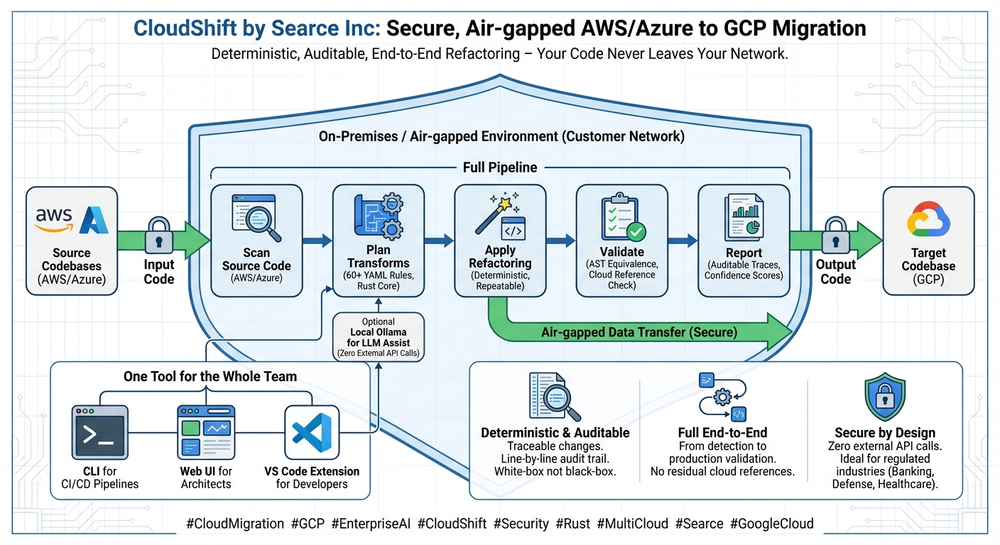

# CloudShift by Searce Inc

**Secure, Air-gapped AWS/Azure to GCP Migration**

Deterministic, Auditable, End-to-End Refactoring — Your Code Never Leaves Your Network.



---

## What is CloudShift?

CloudShift is an enterprise-grade refactoring accelerator that automatically transforms source code and Infrastructure-as-Code from AWS and Azure to Google Cloud Platform. It runs entirely on-premises with zero external API calls, making it ideal for regulated industries — banking, defense, healthcare, and government.

### Key Differentiators

- **Deterministic & Auditable** — Traceable changes with line-by-line audit trail. White-box, not black-box.
- **Full End-to-End** — From detection to production validation. No residual cloud references.
- **Secure by Design** — Zero external API calls. All processing happens inside your network.
- **Hybrid AI Architecture** — 134 compiled YAML pattern rules (Rust core) with optional local LLM assist via Ollama. The LLM never operates unsupervised.
- **Cloud-Agnostic Deployment** — Single Helm chart deploys to AWS (EKS), Azure (AKS), or GCP (GKE) with per-cloud value overrides.

---

## How It Works

CloudShift uses a five-stage pipeline:

1. **Scan** — Parse source code (Python, TypeScript, Terraform, CloudFormation) using tree-sitter. Detect AWS/Azure service usage with high-confidence pattern matching.
2. **Plan** — Match detected constructs against 134 migration patterns. Generate a dependency-aware transformation plan with confidence scores.
3. **Apply** — Execute deterministic, repeatable code transformations. Produce unified diffs for every change.
4. **Validate** — AST equivalence checking, residual cloud reference scanning, SDK surface coverage verification, and optional test suite execution.
5. **Report** — Generate auditable migration reports with per-file confidence scores and issue tracking.

---

## Architecture

**Hybrid Rust + Python** — The performance-critical core (parsing, detection, pattern matching, diffing, validation) is written in Rust and exposed to Python via PyO3. The application layer follows hexagonal / clean architecture (DDD) in Python.

```
Rust Core (cloudshift-core)          Python Application Layer
├── Tree-sitter parsers              ├── Domain (entities, value objects, ports)
├── AWS/Azure service detectors      ├── Application (use cases, orchestration)
├── YAML pattern engine              ├── Infrastructure (adapters, LLM, persistence)
├── Unified diff generator           └── Presentation (CLI, REST API, WebSocket)
├── Dependency graph builder
└── AST validation engine
```

### Delivery Surfaces — One Tool for the Whole Team

| Surface | Audience | Description |
|---------|----------|-------------|
| **CLI** | CI/CD Pipelines | `cloudshift scan \| plan \| apply \| validate \| report` with JSON output mode |
| **Web UI** | Architects | React 19 + Monaco Editor diff viewer + real-time WebSocket progress |
| **VS Code Extension** | Developers | Inline annotations, context menu refactoring, diagnostics panel |

---

## Quick Start

### Prerequisites

- Python 3.12+
- Rust 1.75+ (for building the core)
- Node.js 22+ (for Web UI)

### Installation

```bash
# Clone the repository
git clone https://github.com/asmeyatsky/cloudshift.git
cd cloudshift

# Build the Rust core and install the Python package
pip install maturin
maturin develop

# Install Python dependencies
pip install -e ".[dev]"
```

### Basic Usage

```bash
# Scan a project for AWS service usage
cloudshift scan ./my-aws-project --source AWS --target GCP

# Generate a migration plan
cloudshift plan <project-id> <manifest-id>

# Apply transformations (dry run first)
cloudshift apply <plan-id> --dry-run

# Apply for real
cloudshift apply <plan-id>

# Validate the result
cloudshift validate <plan-id>

# Generate an audit report
cloudshift report <project-id>
```

---

## Supported Migrations

### Languages

| Language | Source Formats | Status |
|----------|---------------|--------|
| Python | boto3, azure-sdk | Full support |
| TypeScript | @aws-sdk, @azure | Full support |
| Terraform HCL | aws_*, azurerm_* | Full support |
| CloudFormation | JSON/YAML templates | Full support |

### Service Mappings (134 patterns)

| AWS / Azure | GCP Equivalent |
|-------------|----------------|
| S3 / Blob Storage | Cloud Storage |
| DynamoDB / Cosmos DB | Firestore or Bigtable |
| Lambda / Functions | Cloud Functions or Cloud Run |
| SQS / Service Bus | Pub/Sub |
| SNS | Pub/Sub (push subscriptions) |
| Secrets Manager / Key Vault | Secret Manager |
| RDS / Azure SQL | Cloud SQL |
| ElastiCache / Redis Cache | Memorystore |
| ECS/EKS / AKS | GKE or Cloud Run |
| CloudFormation / ARM | Deployment Manager or Terraform |
| CloudWatch / Monitor | Cloud Monitoring + Logging |
| IAM / Azure AD | Cloud IAM |

---

## Optional: LLM-Assisted Transforms

CloudShift includes optional local LLM integration via [Ollama](https://ollama.ai) for edge cases outside the pattern catalogue. The LLM runs entirely on your machine — no data leaves your network.

```bash
# Install Ollama and pull the recommended model
brew install ollama
ollama pull qwen2.5-coder:14b

# Enable in CloudShift
cloudshift config set llm.enabled true
cloudshift config set llm.model qwen2.5-coder:14b
```

See [docs/ollama-integration.md](docs/ollama-integration.md) for air-gapped deployment, Docker setup, and model fine-tuning.

---

## Development

### Running Tests

```bash
# Rust unit tests (31 tests)
cargo test --lib

# Python test suite (690 tests, 99.9% coverage)
python -m pytest tests/ -q

# Coverage report
python -m coverage run --source=python/cloudshift -m pytest tests/
python -m coverage report --show-missing
```

### Project Structure

```
cloudshift/
├── rust/cloudshift-core/     # Rust core (parsers, detectors, pattern engine)
├── python/cloudshift/        # Python application (hexagonal architecture)
│   ├── domain/               # Entities, value objects, ports (zero dependencies)
│   ├── application/          # Use cases, orchestration agents, DTOs
│   ├── infrastructure/       # Rust adapters, LLM, persistence, file system
│   └── presentation/         # CLI (Typer), REST API (FastAPI), WebSocket
├── ui/                       # React 19 + Vite + shadcn/ui Web UI
├── vscode-extension/         # VS Code extension
├── patterns/                 # 134 YAML migration pattern rules
├── tests/                    # 690+ tests across all layers
├── docker/                   # Dockerfile + docker-compose.yml
├── deploy/                   # kubernetes-demo.yaml (demo) + helm/ (production, any K8s)
└── docs/                     # Ollama integration, architecture docs
```

### Build Commands

```bash
make build          # Build Rust core + Python package
make test           # Run all tests
make lint           # Run ruff linter
make ui             # Build Web UI (npm run build)
make vscode         # Build VS Code extension
make docker         # Build Docker image
```

---

## Deployment

CloudShift ships as **one Docker image** for both **demo** and **production**. Long-term it is deployed on client site (on-prem or air-gapped) as this image; demos use the same image via Docker or any Kubernetes cluster.

- **Demo:** Run the image with Docker, deploy to [Cloud Run](docs/demo.md#demo-deploy-to-cloud-run), or use the [minimal Kubernetes manifest](deploy/kubernetes-demo.yaml) on any cluster. See [docs/demo.md](docs/demo.md).
- **Production / client-site:** Deploy the same image with the **Helm chart** on the client’s Kubernetes (GKE, EKS, AKS, or on-prem). The chart is Kubernetes-flavour agnostic; cloud-specific behaviour is in value overrides.

### Docker image

The multi-stage Dockerfile produces a single image (API + Web UI + patterns):

```
Stage 1: rust:1.93        → compiles cloudshift-core (tree-sitter, pattern engine)
Stage 2: python:3.13-slim → builds the Python wheel via Maturin (PyO3 bindings)
Stage 3: node:22-slim     → builds the React UI (Vite production bundle)
Stage 4: python:3.13-slim → final image with wheel + static assets + patterns
```

```bash
# Build
docker build -t cloudshift:0.1.0 -f docker/Dockerfile .

# Demo: run locally (no LLM)
docker run -d -p 8000:8000 -e CLOUDSHIFT_LLM_ENABLED=false -v cloudshift-data:/app/data cloudshift:0.1.0
# Web UI: http://localhost:8000
```

Or use docker-compose from the repo:

```bash
# Standalone (no LLM)
docker compose up app-standalone

# Full stack with Ollama LLM
docker compose --profile full up -d
```

### Kubernetes (any flavour)

**Demo (minimal, no Helm):** Deploy on any cluster, then port-forward:

```bash
kubectl apply -f deploy/kubernetes-demo.yaml
kubectl port-forward svc/cloudshift-demo 8000:80
```

Override the image in the manifest if you use a different tag or registry. See [docs/demo.md](docs/demo.md).

**Production / client-site (Helm):** One chart for GKE, EKS, AKS, or on-prem. Use the value override that matches the environment:

```bash
# Deploy to AWS (EKS)
helm install cloudshift ./deploy/helm/cloudshift -f deploy/helm/values-aws.yaml

# Deploy to GCP (GKE)
helm install cloudshift ./deploy/helm/cloudshift -f deploy/helm/values-gcp.yaml

# Deploy to Azure (AKS)
helm install cloudshift ./deploy/helm/cloudshift -f deploy/helm/values-azure.yaml

# On-prem / air-gapped: use client registry
helm install cloudshift ./deploy/helm/cloudshift \
  --set global.imageRegistry=registry.internal.corp \
  -f deploy/helm/values-gcp.yaml
```

**What each override configures:**

| | AWS (EKS) | GCP (GKE) | Azure (AKS) |
|---|---|---|---|
| Ingress | ALB (internet-facing) | GCE + managed cert | nginx + cert-manager |
| Storage | gp3 (EBS CSI) | standard-rwo (PD) | managed-csi (Azure Disk) |
| GPU nodes | g5.xlarge (A10G) | nvidia-tesla-t4 | gpu agent pool |
| Identity | IRSA role ARN | Workload Identity SA | Workload Identity client ID |
| TLS | ACM certificate ARN | GKE managed certificate | Let's Encrypt (cert-manager) |

**Chart components:** API deployment (replicas, health probes, PVC), optional Ollama with GPU, Ingress, ServiceAccount for cloud IAM.

### On-Premises / Air-Gapped

Same image; transfer and load on the client network:

1. Build the Docker image on a machine with internet access.
2. `docker save cloudshift:0.1.0 | gzip > cloudshift.tar.gz`
3. Transfer via USB or secure file transfer.
4. `docker load < cloudshift.tar.gz`
5. Push to the client’s internal registry (if using Kubernetes), or run with Docker. For Kubernetes, use the Helm chart with `global.imageRegistry` set to the client registry.
6. Optionally bundle the Ollama model (see [scripts/export-model.sh](scripts/export-model.sh)).

### Hardware Requirements

| Component | Minimum | Recommended |
|-----------|---------|-------------|
| CPU | 4 cores | 8+ cores |
| RAM | 16 GB | 32 GB |
| Disk | 20 GB free | 50 GB free |
| GPU | Not required | NVIDIA 16+ GB VRAM (for LLM) |

---

## License

Proprietary — Searce Inc. All rights reserved.
